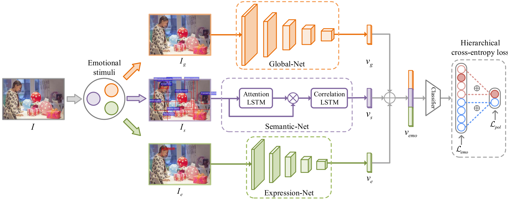

# Stimuli-aware Visual Emotion Analysis (TIP2021)

Jingyuan Yang; Jie Li; Xiumei Wang; Yuxuan Ding; Xinbo Gao 
### [Paper](https://ieeexplore.ieee.org/stamp/stamp.jsp?tp=&arnumber=9524517)

Visual emotion analysis (VEA) has attracted great attention recently, due to the increasing tendency of expressing and understanding emotions through images on social networks. Different from traditional vision tasks, VEA is inherently more challenging since it involves a much higher level of complexity and ambiguity in human cognitive process. Most of the existing methods adopt deep learning techniques to extract general features from the whole image, disregarding the specific features evoked by various emotional stimuli. Inspired by the Stimuli-Organism-Response (S-O-R) emotion model in psychological theory, we proposed a stimuli-aware VEA method consisting of three stages, namely stimuli selection (S), feature extraction (O) and emotion prediction (R). First, specific emotional stimuli ( i.e., color, object, face) are selected from images by employing the off-the-shelf tools. To the best of our knowledge, it is the first time to introduce stimuli selection process into VEA in an end-to-end network. Then, we design three specific networks, i.e., Global-Net, Semantic-Net and Expression-Net, to extract distinct emotional features from different stimuli simultaneously. Finally, benefiting from the inherent structure of Mikel’s wheel, we design a novel hierarchical cross-entropy loss to distinguish hard false examples from easy ones in an emotion-specific manner. Experiments demonstrate that the proposed method consistently outperforms the state-of-the-art approaches on four public visual emotion datasets. Ablation study and visualizations further prove the validity and interpretability of our method.

